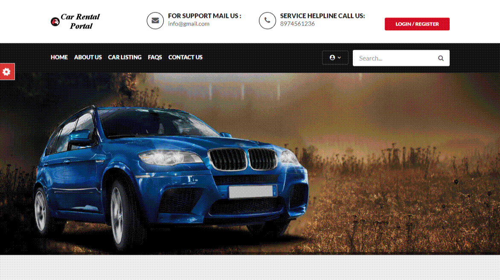
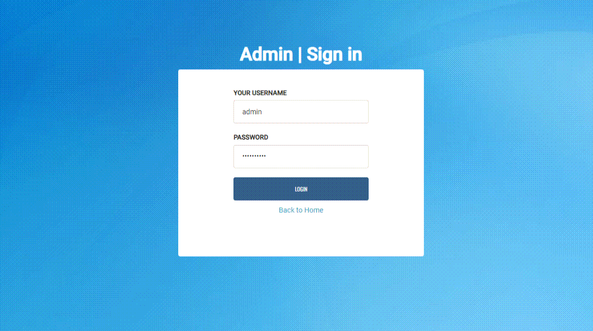

# Car Rental Project

This project is a web application for managing car rentals.

## How to Run

### 1. **Download and Setup**

- Clone or download the repository.
- Copy the `carrental` folder to your server’s root directory:
  - **For XAMPP**: `xampp/htdocs`
  - **For WAMP**: `wamp/www`
  - **For LAMP**: `var/www/html`

### 2. **Database Configuration**

- Open phpMyAdmin and create a database named `carrental`.
- Import the `carrental.sql` file from the SQL folder.

### 3. **Running the Application**

- **User Access**:  
  Open your browser: `http://localhost/carrental`  
  **Login**: `test@gmail.com` / `Test@123`

- **Admin Access**:  
  Open your browser: `http://localhost/carrental/admin`  
  **Login**: `admin` / `Test@12345`

### 4. **Demos**

- **User Demo**:  
  
  
- **Admin Demo**:  
  

### 5. **Notes**

- Ensure your web server (XAMPP/WAMP/LAMP) is running.
- PHP and MySQL must be installed and configured.
